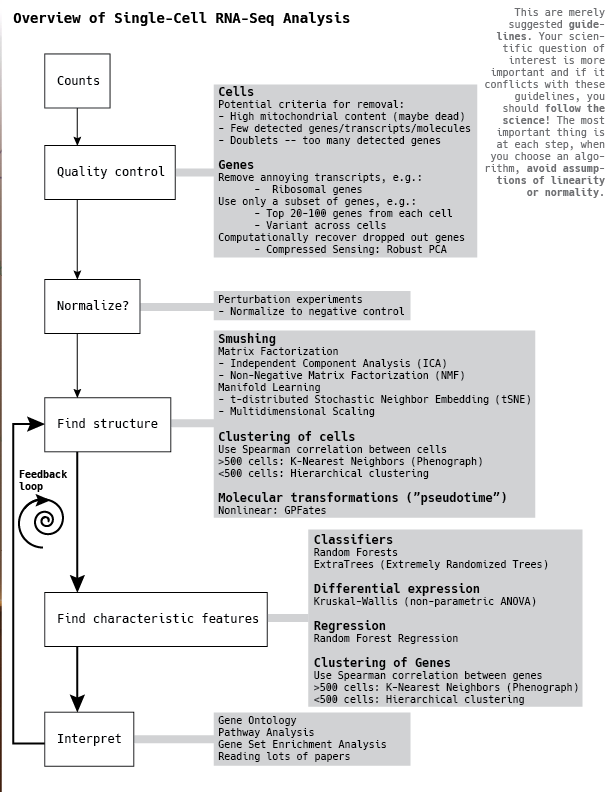

# Learning goals

## 0. Python Introduction
- Object orientation

### Strings

- `str.split`
- `str.upper`
- indexing: `s[:10]` , `s[4]`, `s[6:]`, `s[-1]`, `s[:-5]`

### Pandas

## 1. Quality control

Coding

- `pd.read_csv`, `pd.read_table`
- `df.rename`
- `str.split`
- `df.colname.str.split`
- `df.T` / `df.transpose()`
- 

## 2. Normalize

## 3. Find structure

### Clustering

### Smushing (Dimensionality reduction)

#### Matrix decomposition

All of these are linear methods

- PCA
  - Deterministic
  - Sign of components doesn't matter
  - Uses "loudest" signals - most highly expressed genes
  - Order of components matters: highest is first
  - Can't separate signals, only find the biggest variance
- ICA
  - Sign of components doesn't matter
  - Separates signals
  - Doesn't find biggest variance
  - Depends on random state: Isn't deterministic - stochastic
    - Setting random seed matters
  - Performs "clustering"
    - Number of components matters
- NMF
  - Similar to ICA, but all input data must be non-negative

Coding goals

  - `smusher` object
  - `smusher.fit_transform`
  - `smusher.compnents_`
  - `smusher.explained_variance_ratio_` (PCA only)
  - `np.random.seed(0)` and `random_state=0`
  - `sns.pairplot`
  - `pandas.DataFrame.join`
  - `groupby`
    - Aggregating operations: `df.groupby('celltype').mean()`
  - `sns.heatmap`
  - `df.apply(np.linalg.norm, axis=1)`

#### Manifold learning
Non-linear

- Multidimensional scaling (MDS)
  - Preserves overall structure
  - But structure could still be really complex and hard to see
- t-Distributed Stochastic Neighbor Embedding
  - Visualization technique only
  - Makes slight differences bigger
  - Depends on random state

## 4. Find characteristic features

## 5. Interpret

## Other topics

### GitHub